# Dokumentasi Sistem Helpdesk IT

> **Dokumen Transfer Knowledge**  
> Versi: 1.0  
> Tanggal: 31 Desember 2025  
> Disiapkan untuk: Tim IT Support

---

## 📋 Daftar Isi

1. [Gambaran Umum Proyek](#1-gambaran-umum-proyek)
2. [Arsitektur Sistem](#2-arsitektur-sistem)
3. [Skema Database & ERD](#3-skema-database--erd)
4. [Model & Relasi](#4-model--relasi)
5. [Autentikasi & Login](#5-autentikasi--login)
6. [Modul Ticket](#6-modul-ticket)
7. [Modul Task](#7-modul-task)
8. [Modul Handbook](#8-modul-handbook)
9. [Modul Laporan Harian](#9-modul-laporan-harian)
10. [Modul Laporan Bulanan](#10-modul-laporan-bulanan)
11. [Modul Activity Log](#11-modul-activity-log)
12. [Modul Profile](#12-modul-profile)
13. [API Reference](#13-api-reference)
14. [Alur Data & Workflow](#14-alur-data--workflow)

---

## 1. Gambaran Umum Proyek

### 1.1 Deskripsi Sistem

**Helpdesk IT System** adalah aplikasi web berbasis Laravel yang dirancang untuk mengelola operasional IT Support. Sistem ini mencakup:

- **Manajemen Tiket** - Pengguna dapat membuat tiket, IT Support menangani dan menyelesaikan
- **Manajemen Tugas** - Pelacakan tugas harian dan bulanan
- **Laporan Harian/Bulanan** - Dokumentasi aktivitas IT Support
- **Knowledge Base (Handbook)** - Repository SOP dan dokumentasi
- **Activity Logging** - Audit trail semua aktivitas sistem

### 1.2 Technology Stack

| Komponen   | Teknologi                               |
| ---------- | --------------------------------------- |
| Framework  | Laravel 12                              |
| Bahasa     | PHP 8.3.11                              |
| Database   | MySQL                                   |
| Frontend   | Blade Templates, TailwindCSS, Alpine.js |
| PDF        | Spatie Laravel PDF                      |
| RBAC       | Spatie Permission                       |
| Logging    | Spatie Activitylog                      |
| Notifikasi | Telegram Bot                            |
| Charts     | Chart.js                                |
| Alerts     | SweetAlert2                             |

### 1.3 Role User

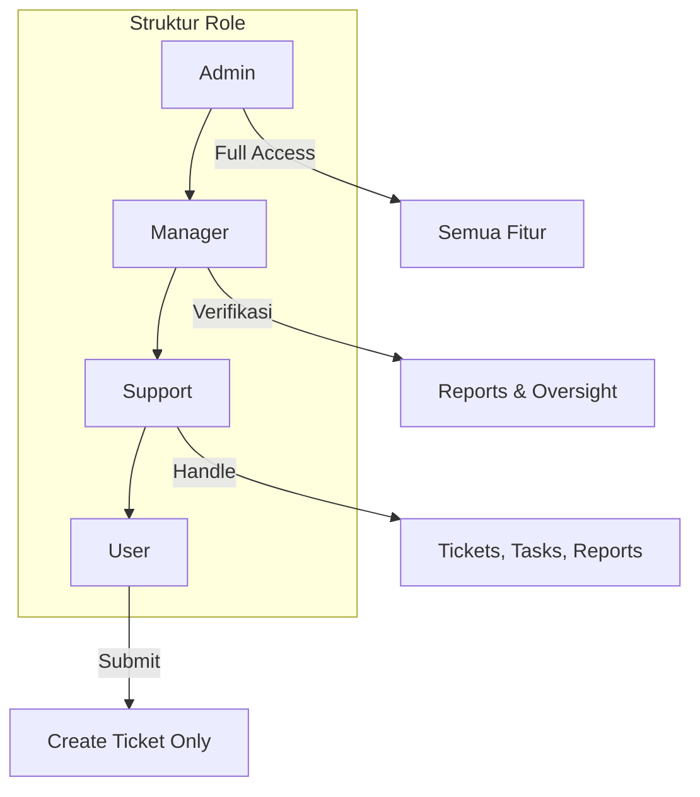
```mermaid
graph TD
    subgraph "Struktur Role"
        A[Admin] --> B[Manager]
        B --> C[Support]
        C --> D[User]
    end

    A --> |Full Access| E[Semua Fitur]
    B --> |Verifikasi| F[Reports & Oversight]
    C --> |Handle| G[Tickets, Tasks, Reports]
    D --> |Submit| H[Create Ticket Only]
```

| Role        | Akses                                          |
| ----------- | ---------------------------------------------- |
| **Admin**   | Full system control, user management, settings |
| **Manager** | Report verification, team oversight            |
| **Support** | Ticket handling, task management, reporting    |
| **User**    | Ticket submission & tracking                   |

---

## 2. Arsitektur Sistem

### 2.1 Struktur Folder Utama

```
HelpdeskITSystem/
├── app/
│   ├── Http/
│   │   ├── Controllers/         # Controller utama
│   │   │   ├── Admin/           # Admin controllers
│   │   │   ├── Api/             # API controllers
│   │   │   ├── Auth/            # Authentication
│   │   │   └── Logs/            # Activity log
│   │   └── Requests/            # Form requests
│   ├── Models/                  # Eloquent models
│   ├── Helpers/                 # Helper classes
│   └── Services/                # Service classes
├── database/
│   ├── migrations/              # Database migrations
│   └── seeders/                 # Database seeders
├── resources/
│   └── views/
│       ├── frontend/            # User-facing views
│       ├── backend/             # Admin views
│       ├── auth/                # Auth views
│       └── pdf/                 # PDF templates
├── routes/
│   ├── web.php                  # Web routes
│   ├── api.php                  # API routes
│   └── auth.php                 # Auth routes
└── public/                      # Public assets
```

### 2.2 Arsitektur MVC

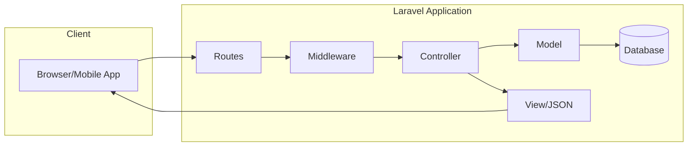
```mermaid
flowchart LR
    subgraph Client
        A[Browser/Mobile App]
    end

    subgraph Laravel Application
        B[Routes] --> C[Middleware]
        C --> D[Controller]
        D --> E[Model]
        E --> F[(Database)]
        D --> G[View/JSON]
    end

    A --> B
    G --> A
```

---

## 3. Skema Database & ERD

### 3.1 Entity Relationship Diagram

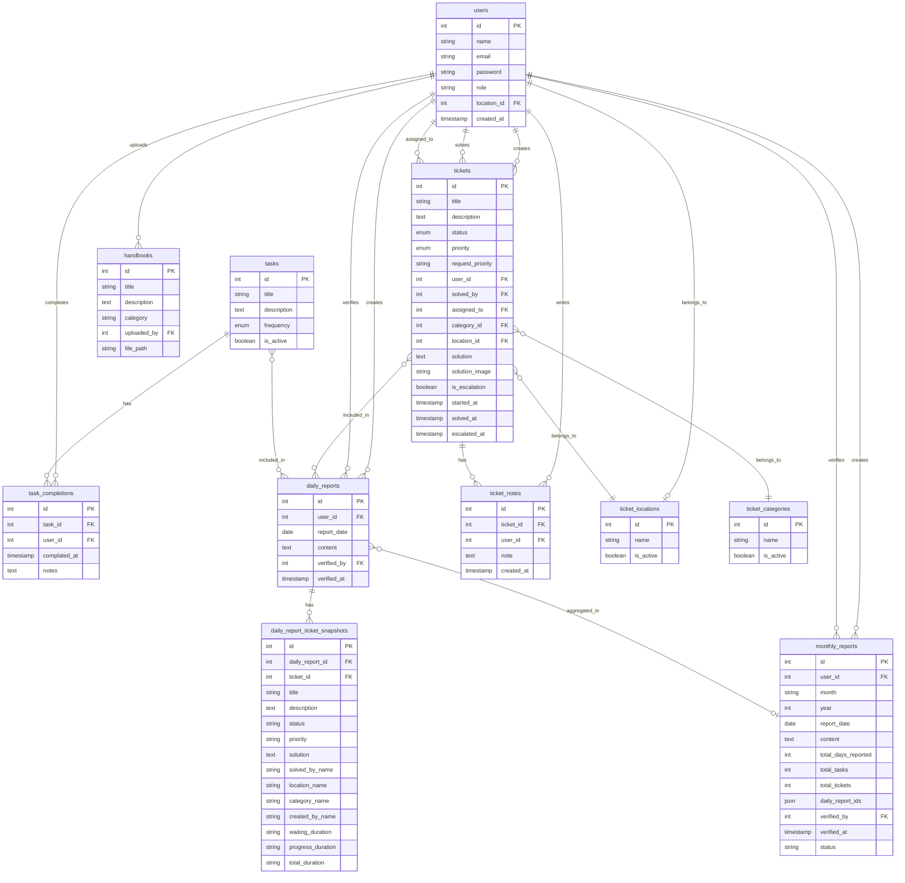
```mermaid
erDiagram
    users ||--o{ tickets : creates
    users ||--o{ tickets : solves
    users ||--o{ tickets : assigned_to
    users ||--o{ task_completions : completes
    users ||--o{ daily_reports : creates
    users ||--o{ daily_reports : verifies
    users ||--o{ monthly_reports : creates
    users ||--o{ monthly_reports : verifies
    users ||--o{ handbooks : uploads
    users ||--o{ ticket_notes : writes
    users ||--o| ticket_locations : belongs_to

    tickets ||--o{ ticket_notes : has
    tickets }o--|| ticket_categories : belongs_to
    tickets }o--|| ticket_locations : belongs_to
    tickets }o--o{ daily_reports : included_in

    tasks ||--o{ task_completions : has
    tasks }o--o{ daily_reports : included_in

    daily_reports ||--o{ daily_report_ticket_snapshots : has
    daily_reports }o--o| monthly_reports : aggregated_in

    users {
        int id PK
        string name
        string email
        string password
        string role
        int location_id FK
        timestamp created_at
    }

    tickets {
        int id PK
        string title
        text description
        enum status
        enum priority
        string request_priority
        int user_id FK
        int solved_by FK
        int assigned_to FK
        int category_id FK
        int location_id FK
        text solution
        string solution_image
        boolean is_escalation
        timestamp started_at
        timestamp solved_at
        timestamp escalated_at
    }

    ticket_categories {
        int id PK
        string name
        boolean is_active
    }

    ticket_locations {
        int id PK
        string name
        boolean is_active
    }

    ticket_notes {
        int id PK
        int ticket_id FK
        int user_id FK
        text note
        timestamp created_at
    }

    tasks {
        int id PK
        string title
        text description
        enum frequency
        boolean is_active
    }

    task_completions {
        int id PK
        int task_id FK
        int user_id FK
        timestamp complated_at
        text notes
    }

    daily_reports {
        int id PK
        int user_id FK
        date report_date
        text content
        int verified_by FK
        timestamp verified_at
    }

    daily_report_ticket_snapshots {
        int id PK
        int daily_report_id FK
        int ticket_id FK
        string title
        text description
        string status
        string priority
        text solution
        string solved_by_name
        string location_name
        string category_name
        string created_by_name
        string waiting_duration
        string progress_duration
        string total_duration
    }

    monthly_reports {
        int id PK
        int user_id FK
        string month
        int year
        date report_date
        text content
        int total_days_reported
        int total_tasks
        int total_tickets
        json daily_report_ids
        int verified_by FK
        timestamp verified_at
        string status
    }

    handbooks {
        int id PK
        string title
        text description
        string category
        int uploaded_by FK
        string file_path
    }
```

### 3.2 Daftar Tabel Database

| No  | Tabel                           | Deskripsi                                |
| --- | ------------------------------- | ---------------------------------------- |
| 1   | `users`                         | Data pengguna sistem                     |
| 2   | `tickets`                       | Tiket support yang dibuat user           |
| 3   | `ticket_categories`             | Kategori tiket (Hardware, Software, dll) |
| 4   | `ticket_locations`              | Lokasi/gedung terkait tiket              |
| 5   | `ticket_notes`                  | Catatan/komentar pada tiket              |
| 6   | `tasks`                         | Daftar tugas rutin IT                    |
| 7   | `task_completions`              | Record penyelesaian tugas                |
| 8   | `daily_reports`                 | Laporan harian IT Support                |
| 9   | `daily_report_tasks`            | Pivot table daily_report ↔ tasks         |
| 10  | `daily_report_tickets`          | Pivot table daily_report ↔ tickets       |
| 11  | `daily_report_ticket_snapshots` | Snapshot immutable data tiket            |
| 12  | `monthly_reports`               | Laporan bulanan                          |
| 13  | `handbooks`                     | Dokumen SOP/Handbook                     |
| 14  | `activity_log`                  | Log aktivitas sistem                     |
| 15  | `roles`                         | Role definitions (Spatie)                |
| 16  | `permissions`                   | Permission definitions (Spatie)          |
| 17  | `model_has_roles`               | User-role assignments                    |
| 18  | `model_has_permissions`         | User-permission assignments              |

---

## 4. Model & Relasi

### 4.1 Model User

**File:** `app/Models/User.php`

```php
// Atribut
protected $fillable = [
    'name', 'email', 'password', 'role', 'location_id'
];

// Relasi
public function location(): BelongsTo
{
    return $this->belongsTo(TicketLocation::class, 'location_id');
}
```

**Traits yang digunakan:**

- `HasFactory` - Factory untuk testing
- `Notifiable` - Notifikasi
- `HasRoles` - Spatie Permission
- `HasApiTokens` - Laravel Sanctum

### 4.2 Model Ticket

**File:** `app/Models/Ticket.php`

```php
// Atribut
protected $fillable = [
    'title', 'description', 'status', 'priority', 'request_priority',
    'user_id', 'solution', 'solution_image', 'solved_by', 'started_at',
    'solved_at', 'assigned_to', 'duration', 'category_id', 'location_id',
    'is_escalation', 'escalated_at'
];

// Status yang tersedia
// 'Open', 'In Progress', 'Closed'

// Priority yang tersedia
// 'Low', 'Medium', 'High'
```

**Relasi:**

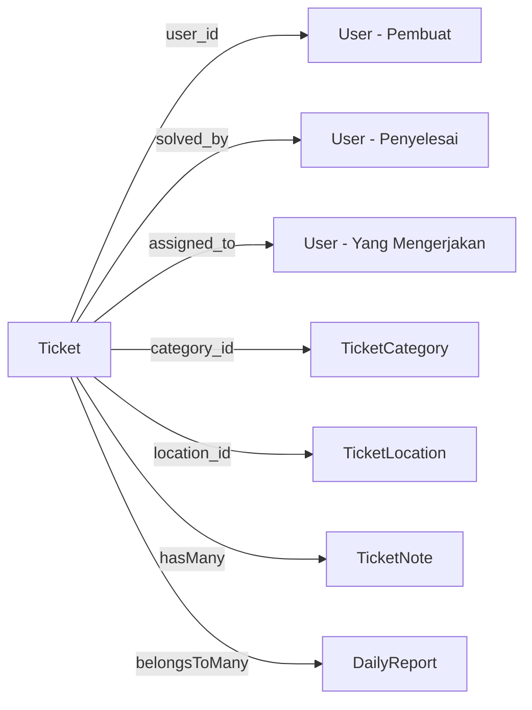
```mermaid
graph LR
    Ticket --> |user_id| User[User - Pembuat]
    Ticket --> |solved_by| Solver[User - Penyelesai]
    Ticket --> |assigned_to| Assignee[User - Yang Mengerjakan]
    Ticket --> |category_id| Category[TicketCategory]
    Ticket --> |location_id| Location[TicketLocation]
    Ticket --> |hasMany| Notes[TicketNote]
    Ticket --> |belongsToMany| DailyReport
```

**Accessor (Computed Attributes):**

- `waiting_duration_human` - Durasi menunggu (created → started)
- `progress_duration_human` - Durasi pengerjaan (started → solved)
- `total_duration_human` - Total durasi (created → solved)
- `solution_image_url` - URL gambar solusi

### 4.3 Model Task

**File:** `app/Models/Task.php`

```php
protected $fillable = [
    'title', 'description', 'frequency', 'is_active'
];

// Frequency: 'daily' atau 'monthly'
```

**Relasi:**

- `completions()` → HasMany ke TaskCompletion
- `dailyReports()` → BelongsToMany ke DailyReport

### 4.4 Model TaskCompletion

**File:** `app/Models/TaskCompletion.php`

```php
protected $fillable = [
    'task_id', 'user_id', 'complated_at', 'notes'
];
```

**Relasi:**

- `task()` → BelongsTo Task
- `user()` → BelongsTo User

### 4.5 Model DailyReport

**File:** `app/Models/DailyReport.php`

```php
protected $fillable = [
    'user_id', 'report_date', 'content', 'verified_by', 'verified_at'
];
```

**Relasi:**

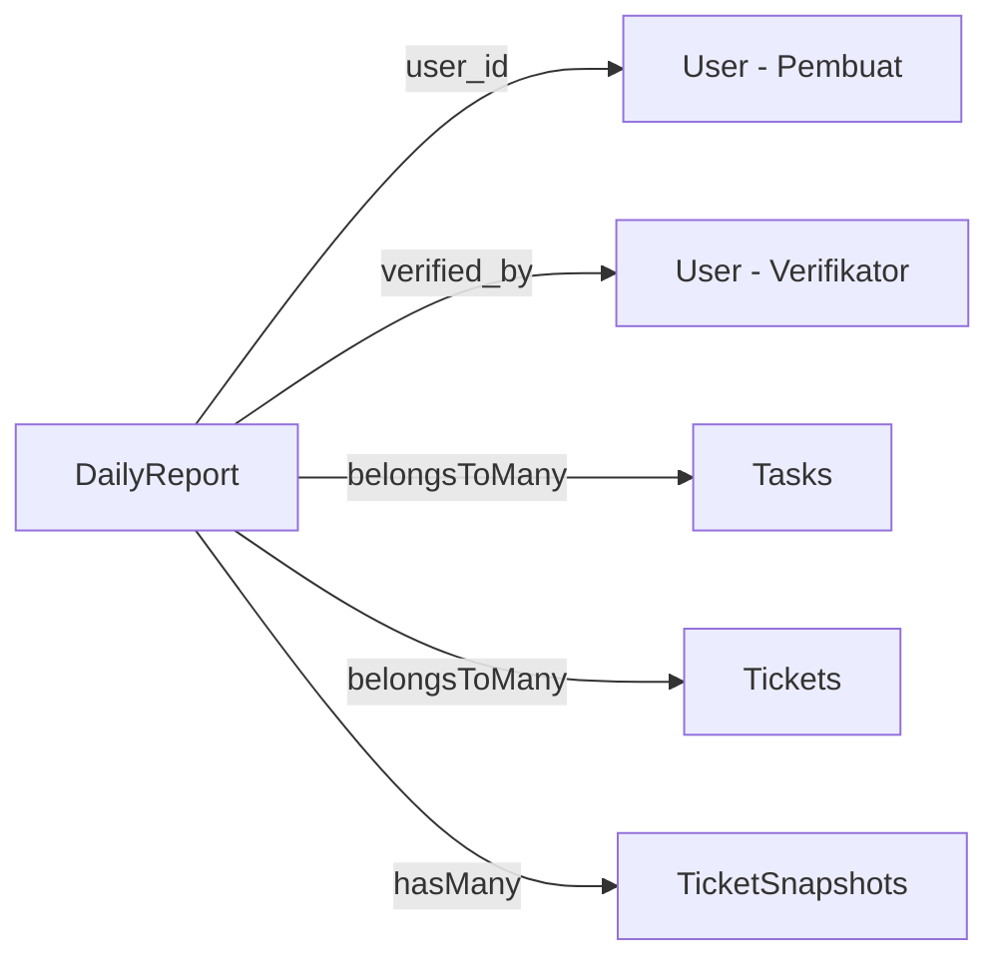
```mermaid
graph LR
    DailyReport --> |user_id| Creator[User - Pembuat]
    DailyReport --> |verified_by| Verifier[User - Verifikator]
    DailyReport --> |belongsToMany| Tasks
    DailyReport --> |belongsToMany| Tickets
    DailyReport --> |hasMany| Snapshots[TicketSnapshots]
```

### 4.6 Model DailyReportTicketSnapshot

**File:** `app/Models/DailyReportTicketSnapshot.php`

> **Catatan Penting:** Model ini menyimpan **snapshot immutable** dari data tiket saat laporan dibuat. Ini memastikan data historis tidak berubah meskipun tiket asli diupdate.

```php
protected $fillable = [
    'daily_report_id', 'ticket_id', 'title', 'description', 'status',
    'priority', 'solution', 'solved_by', 'solved_by_name', 'location_id',
    'location_name', 'category_id', 'category_name', 'created_by',
    'created_by_name', 'ticket_created_at', 'ticket_started_at',
    'ticket_solved_at', 'waiting_duration', 'progress_duration', 'total_duration'
];
```

### 4.7 Model MonthlyReport

**File:** `app/Models/MonthlyReport.php`

```php
protected $fillable = [
    'user_id', 'month', 'year', 'report_date', 'content',
    'total_days_reported', 'total_tasks', 'total_tickets',
    'daily_report_ids', 'verified_by', 'verified_at', 'status'
];

// daily_report_ids disimpan sebagai JSON array
```

**Scopes:**

- `scopeForPeriod($month, $year)` - Filter berdasarkan periode
- `scopeVerified()` - Filter hanya yang terverifikasi
- `scopePending()` - Filter yang belum verifikasi

### 4.8 Model Handbook

**File:** `app/Models/Handbook.php`

```php
protected $fillable = [
    'title', 'description', 'category', 'uploaded_by', 'file_path'
];
```

**Relasi:**

- `uploader()` → BelongsTo User

---

## 5. Autentikasi & Login

### 5.1 Alur Login

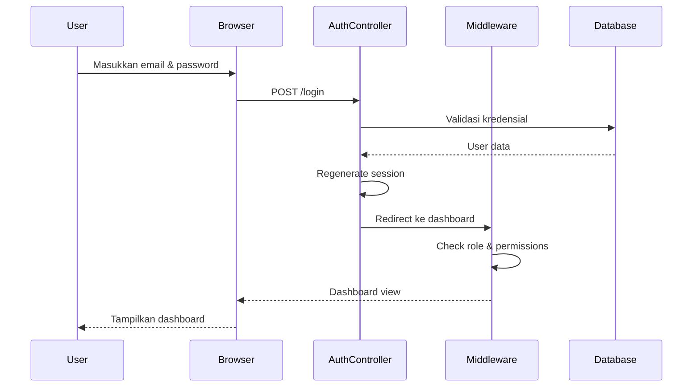
```mermaid
sequenceDiagram
    participant U as User
    participant B as Browser
    participant C as AuthController
    participant M as Middleware
    participant DB as Database

    U->>B: Masukkan email & password
    B->>C: POST /login
    C->>DB: Validasi kredensial
    DB-->>C: User data
    C->>C: Regenerate session
    C->>M: Redirect ke dashboard
    M->>M: Check role & permissions
    M-->>B: Dashboard view
    B-->>U: Tampilkan dashboard
```

### 5.2 Controller & Routes

**Controller:** `app/Http/Controllers/Auth/AuthenticatedSessionController.php`

| Method      | Route          | Deskripsi            |
| ----------- | -------------- | -------------------- |
| `create()`  | GET `/login`   | Tampilkan form login |
| `store()`   | POST `/login`  | Proses login         |
| `destroy()` | POST `/logout` | Proses logout        |

### 5.3 Middleware Authentication

```php
// routes/web.php
Route::middleware('auth')->group(function () {
    // Semua route yang membutuhkan login
});

// Untuk route admin
Route::middleware(['role:admin'])->prefix('admin')->group(function () {
    // Route khusus admin
});
```

### 5.4 API Authentication (Sanctum)

**Controller:** `app/Http/Controllers/Api/AuthController.php`

| Method       | Endpoint             | Deskripsi          |
| ------------ | -------------------- | ------------------ |
| `login()`    | POST `/api/login`    | Login & get token  |
| `logout()`   | POST `/api/logout`   | Revoke token       |
| `register()` | POST `/api/register` | Register user baru |
| `me()`       | GET `/api/me`        | Get current user   |

---

## 6. Modul Ticket

### 6.1 Deskripsi

Modul ticket adalah fitur utama sistem untuk mengelola permintaan bantuan IT dari pengguna.

### 6.2 Status Ticket

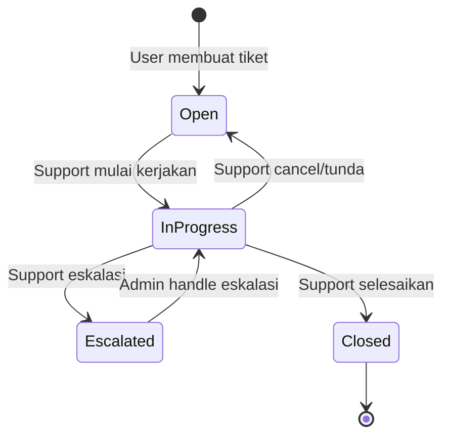
```mermaid
stateDiagram-v2
    [*] --> Open: User membuat tiket
    Open --> InProgress: Support mulai kerjakan
    InProgress --> Open: Support cancel/tunda
    InProgress --> Escalated: Support eskalasi
    Escalated --> InProgress: Admin handle eskalasi
    InProgress --> Closed: Support selesaikan
    Closed --> [*]
```

| Status          | Deskripsi                      |
| --------------- | ------------------------------ |
| **Open**        | Tiket baru, belum ditangani    |
| **In Progress** | Sedang dikerjakan oleh Support |
| **Closed**      | Tiket selesai dengan solusi    |

### 6.3 Controller & Methods

**Controller:** `app/Http/Controllers/TicketController.php`

| Method              | Route                            | HTTP   | Deskripsi                           |
| ------------------- | -------------------------------- | ------ | ----------------------------------- |
| `index()`           | `/tickets`                       | GET    | Daftar tiket dengan filter & search |
| `store()`           | `/tickets/store`                 | POST   | Buat tiket baru                     |
| `show()`            | `/tickets/{id}`                  | GET    | Detail tiket (JSON untuk modal)     |
| `update()`          | `/tickets/{id}`                  | PATCH  | Update tiket                        |
| `destroy()`         | `/tickets/{id}`                  | DELETE | Hapus tiket                         |
| `start()`           | `/tickets/{id}/start`            | POST   | Mulai kerjakan tiket                |
| `takeOver()`        | `/tickets/{id}/take-over`        | POST   | Ambil alih tiket                    |
| `close()`           | `/tickets/{id}/close`            | POST   | Selesaikan tiket                    |
| `escalate()`        | `/tickets/{id}/escalate`         | POST   | Eskalasi ke Admin                   |
| `handleEscalated()` | `/tickets/{id}/handle-escalated` | PUT    | Admin handle eskalasi               |
| `cancel()`          | `/tickets/{id}/cancel`           | POST   | Tunda pengerjaan tiket              |
| `setPriority()`     | `/tickets/{id}/set-priority`     | PATCH  | Set prioritas (Admin only)          |
| `storeNote()`       | `/tickets/{id}/notes`            | POST   | Tambah catatan ke tiket             |

### 6.4 Alur Pembuatan Ticket

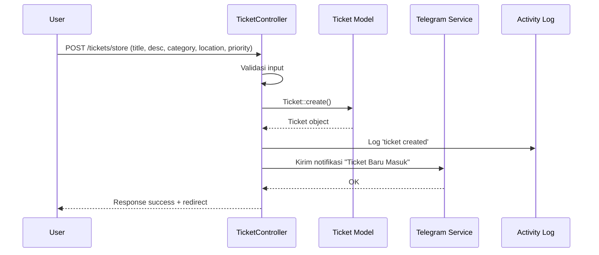
```mermaid
sequenceDiagram
    participant U as User
    participant TC as TicketController
    participant T as Ticket Model
    participant TG as Telegram Service
    participant AL as Activity Log

    U->>TC: POST /tickets/store (title, desc, category, location, priority)
    TC->>TC: Validasi input
    TC->>T: Ticket::create()
    T-->>TC: Ticket object
    TC->>AL: Log 'ticket created'
    TC->>TG: Kirim notifikasi "Ticket Baru Masuk"
    TG-->>TC: OK
    TC-->>U: Response success + redirect
```

### 6.5 Alur Penyelesaian Ticket

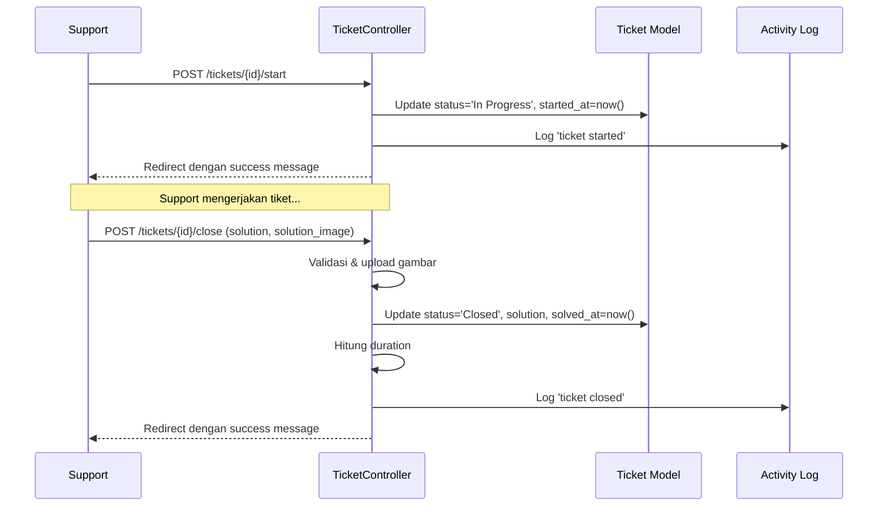
```mermaid
sequenceDiagram
    participant S as Support
    participant TC as TicketController
    participant T as Ticket Model
    participant AL as Activity Log

    S->>TC: POST /tickets/{id}/start
    TC->>T: Update status='In Progress', started_at=now()
    TC->>AL: Log 'ticket started'
    TC-->>S: Redirect dengan success message

    Note over S,TC: Support mengerjakan tiket...

    S->>TC: POST /tickets/{id}/close (solution, solution_image)
    TC->>TC: Validasi & upload gambar
    TC->>T: Update status='Closed', solution, solved_at=now()
    TC->>TC: Hitung duration
    TC->>AL: Log 'ticket closed'
    TC-->>S: Redirect dengan success message
```

### 6.6 Fitur Eskalasi

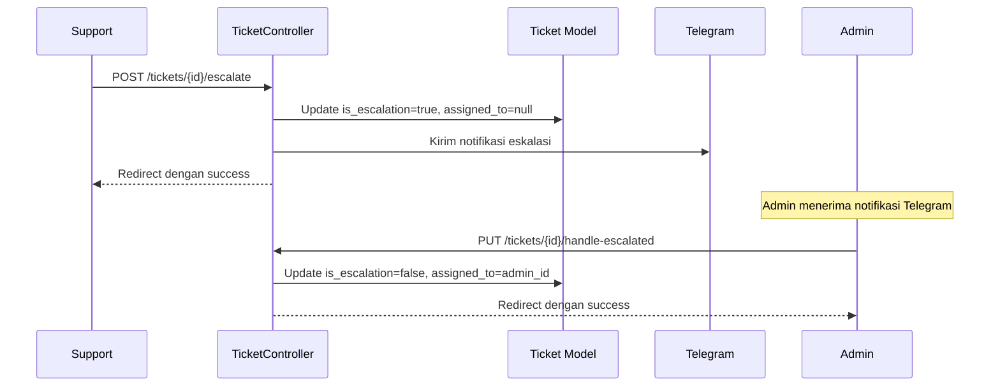
```mermaid
sequenceDiagram
    participant S as Support
    participant TC as TicketController
    participant T as Ticket Model
    participant TG as Telegram
    participant A as Admin

    S->>TC: POST /tickets/{id}/escalate
    TC->>T: Update is_escalation=true, assigned_to=null
    TC->>TG: Kirim notifikasi eskalasi
    TC-->>S: Redirect dengan success

    Note over A: Admin menerima notifikasi Telegram

    A->>TC: PUT /tickets/{id}/handle-escalated
    TC->>T: Update is_escalation=false, assigned_to=admin_id
    TC-->>A: Redirect dengan success
```

### 6.7 Permissions Ticket

| Permission            | Deskripsi                          |
| --------------------- | ---------------------------------- |
| `view-any-tickets`    | Lihat semua tiket                  |
| `edit-own-ticket`     | Edit tiket sendiri                 |
| `delete-own-ticket`   | Hapus tiket sendiri                |
| `handle-ticket`       | Mulai kerjakan tiket               |
| `close-ticket`        | Tutup/selesaikan tiket             |
| `escalate-ticket`     | Eskalasi tiket                     |
| `take-over`           | Ambil alih tiket dari support lain |
| `set-ticket-priority` | Set prioritas tiket (Admin)        |

---

## 7. Modul Task

### 7.1 Deskripsi

Modul task untuk mengelola tugas rutin IT Support yang harus dilakukan secara harian atau bulanan.

### 7.2 Jenis Task

| Frequency   | Deskripsi     | Contoh                        |
| ----------- | ------------- | ----------------------------- |
| **Daily**   | Tugas harian  | Backup database, Cek server   |
| **Monthly** | Tugas bulanan | Update sistem, Audit keamanan |

### 7.3 Controller & Methods

**Controller:** `app/Http/Controllers/TaskController.php`

| Method       | Route                  | HTTP   | Deskripsi            |
| ------------ | ---------------------- | ------ | -------------------- |
| `daily()`    | `/tasks/daily`         | GET    | Daftar tugas harian  |
| `monthly()`  | `/tasks/monthly`       | GET    | Daftar tugas bulanan |
| `show()`     | `/tasks/{id}`          | GET    | Detail tugas (JSON)  |
| `create()`   | `/tasks/create`        | GET    | Form buat tugas      |
| `store()`    | `/tasks/store`         | POST   | Simpan tugas baru    |
| `edit()`     | `/tasks/{id}/edit`     | GET    | Form edit tugas      |
| `update()`   | `/tasks/{id}`          | PUT    | Update tugas         |
| `destroy()`  | `/tasks/{id}`          | DELETE | Hapus tugas          |
| `complete()` | `/tasks/{id}/complete` | POST   | Tandai selesai       |

### 7.4 Alur Penyelesaian Task

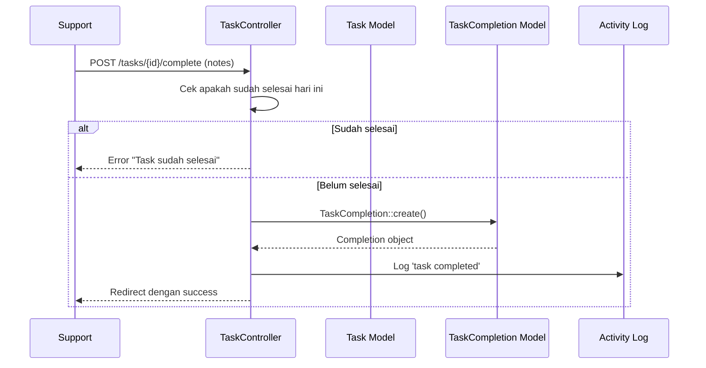
```mermaid
sequenceDiagram
    participant S as Support
    participant TC as TaskController
    participant TM as Task Model
    participant TCM as TaskCompletion Model
    participant AL as Activity Log

    S->>TC: POST /tasks/{id}/complete (notes)
    TC->>TC: Cek apakah sudah selesai hari ini
    alt Sudah selesai
        TC-->>S: Error "Task sudah selesai"
    else Belum selesai
        TC->>TCM: TaskCompletion::create()
        TCM-->>TC: Completion object
        TC->>AL: Log 'task completed'
        TC-->>S: Redirect dengan success
    end
```

### 7.5 Logika Completion Check

```php
// Daily task - cek apakah sudah selesai HARI INI
$alreadyDone = TaskCompletion::where('task_id', $task->id)
    ->where('user_id', auth()->id())
    ->whereDate('complated_at', today())
    ->exists();

// Monthly task - cek berdasarkan BULAN
$completedMonthlys = TaskCompletion::whereMonth('complated_at', now()->month)
    ->whereYear('complated_at', now()->year)
    ->pluck('task_id')
    ->toArray();
```

---

## 8. Modul Handbook

### 8.1 Deskripsi

Modul handbook adalah knowledge base untuk menyimpan SOP, panduan, dan dokumentasi IT.

### 8.2 Controller & Methods

**Controller:** `app/Http/Controllers/HandbookController.php`

| Method          | Route                     | HTTP   | Deskripsi                    |
| --------------- | ------------------------- | ------ | ---------------------------- |
| `index()`       | `/handbook`               | GET    | Daftar handbook              |
| `show()`        | `/handbook/show/{id}`     | GET    | Detail handbook              |
| `create()`      | `/handbook/create`        | GET    | Form buat handbook           |
| `store()`       | `/handbook/store`         | POST   | Simpan handbook + upload PDF |
| `edit()`        | `/handbook/edit/{id}`     | GET    | Form edit handbook           |
| `update()`      | `/handbook/update/{id}`   | PUT    | Update handbook              |
| `destroy()`     | `/handbook/delete/{id}`   | DELETE | Hapus handbook               |
| `downloadPdf()` | `/handbook/download/{id}` | GET    | Download file PDF            |

### 8.3 Alur Upload Handbook

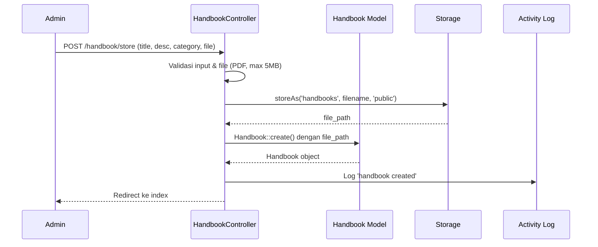
```mermaid
sequenceDiagram
    participant A as Admin
    participant HC as HandbookController
    participant H as Handbook Model
    participant S as Storage
    participant AL as Activity Log

    A->>HC: POST /handbook/store (title, desc, category, file)
    HC->>HC: Validasi input & file (PDF, max 5MB)
    HC->>S: storeAs('handbooks', filename, 'public')
    S-->>HC: file_path
    HC->>H: Handbook::create() dengan file_path
    H-->>HC: Handbook object
    HC->>AL: Log 'handbook created'
    HC-->>A: Redirect ke index
```

### 8.4 Validasi File

```php
$request->validate([
    'title' => 'required|string|max:255',
    'description' => 'required',
    'category' => 'required',
    'file' => 'nullable|mimes:pdf|max:5120', // max 5MB
]);
```

---

## 9. Modul Laporan Harian

### 9.1 Deskripsi

Laporan harian mencatat aktivitas IT Support setiap hari, termasuk tugas yang diselesaikan dan tiket yang ditangani.

### 9.2 Controller & Methods

**Controller:** `app/Http/Controllers/DailyReportController.php`

| Method             | Route                                           | HTTP   | Deskripsi                    |
| ------------------ | ----------------------------------------------- | ------ | ---------------------------- |
| `index()`          | `/reports/daily`                                | GET    | Daftar laporan dengan filter |
| `create()`         | `/reports/daily/create`                         | GET    | Form buat laporan            |
| `store()`          | `/reports/daily`                                | POST   | Simpan laporan               |
| `show()`           | `/reports/daily/{id}`                           | GET    | Detail laporan               |
| `edit()`           | `/reports/daily/{id}/edit`                      | GET    | Form edit laporan            |
| `update()`         | `/reports/daily/{id}`                           | PUT    | Update laporan               |
| `destroy()`        | `/reports/daily/{id}`                           | DELETE | Hapus laporan                |
| `verify()`         | `/reports/daily/{id}/verify`                    | PUT    | Verifikasi laporan           |
| `exportPdf()`      | `/reports/daily/{id}/pdf`                       | GET    | Export ke PDF                |
| `ticketSnapshot()` | `/reports/daily/{id}/tickets/{ticket}/snapshot` | GET    | Lihat snapshot tiket         |

### 9.3 Alur Pembuatan Laporan Harian

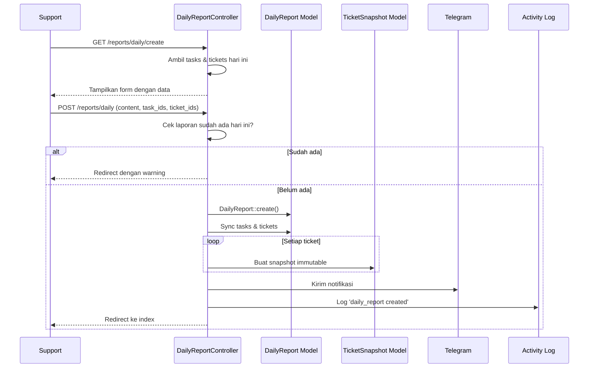
```mermaid
sequenceDiagram
    participant S as Support
    participant DRC as DailyReportController
    participant DR as DailyReport Model
    participant DRTS as TicketSnapshot Model
    participant TG as Telegram
    participant AL as Activity Log

    S->>DRC: GET /reports/daily/create
    DRC->>DRC: Ambil tasks & tickets hari ini
    DRC-->>S: Tampilkan form dengan data

    S->>DRC: POST /reports/daily (content, task_ids, ticket_ids)
    DRC->>DRC: Cek laporan sudah ada hari ini?
    alt Sudah ada
        DRC-->>S: Redirect dengan warning
    else Belum ada
        DRC->>DR: DailyReport::create()
        DRC->>DR: Sync tasks & tickets
        loop Setiap ticket
            DRC->>DRTS: Buat snapshot immutable
        end
        DRC->>TG: Kirim notifikasi
        DRC->>AL: Log 'daily_report created'
        DRC-->>S: Redirect ke index
    end
```

### 9.4 Konsep Ticket Snapshot

> **Penting:** Saat laporan dibuat, sistem menyimpan **snapshot** data tiket ke tabel `daily_report_ticket_snapshots`. Ini memastikan data historis tetap konsisten meskipun tiket diupdate setelahnya.

Data yang di-snapshot:

- Title, description, status, priority
- Solution
- Nama solver, category, location
- Timestamps (created, started, solved)
- Durasi (waiting, progress, total)

### 9.5 Verifikasi Laporan

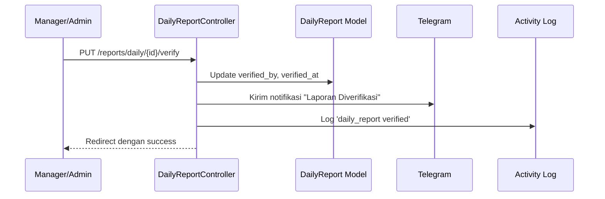
```mermaid
sequenceDiagram
    participant M as Manager/Admin
    participant DRC as DailyReportController
    participant DR as DailyReport Model
    participant TG as Telegram
    participant AL as Activity Log

    M->>DRC: PUT /reports/daily/{id}/verify
    DRC->>DR: Update verified_by, verified_at
    DRC->>TG: Kirim notifikasi "Laporan Diverifikasi"
    DRC->>AL: Log 'daily_report verified'
    DRC-->>M: Redirect dengan success
```

### 9.6 Filter Laporan

| Filter | Parameter | Deskripsi                               |
| ------ | --------- | --------------------------------------- |
| Search | `search`  | Cari di content atau nama user          |
| Date   | `date`    | Filter tanggal laporan                  |
| Status | `status`  | `verified` atau `pending`               |
| User   | `user_id` | Filter berdasarkan user (admin/manager) |
| Sort   | `sort`    | `newest` (default) atau `oldest`        |

---

## 10. Modul Laporan Bulanan

### 10.1 Deskripsi

Laporan bulanan mengagregasi data dari laporan harian dalam satu bulan.

### 10.2 Controller & Methods

**Controller:** `app/Http/Controllers/MonthlyReportController.php`

| Method        | Route                          | HTTP   | Deskripsi              |
| ------------- | ------------------------------ | ------ | ---------------------- |
| `index()`     | `/reports/monthly`             | GET    | Daftar laporan bulanan |
| `create()`    | `/reports/monthly/create`      | GET    | Form buat laporan      |
| `store()`     | `/reports/monthly`             | POST   | Simpan laporan         |
| `show()`      | `/reports/monthly/{id}`        | GET    | Detail laporan         |
| `edit()`      | `/reports/monthly/{id}/edit`   | GET    | Form edit laporan      |
| `update()`    | `/reports/monthly/{id}`        | PUT    | Update laporan         |
| `destroy()`   | `/reports/monthly/{id}`        | DELETE | Hapus laporan          |
| `verify()`    | `/reports/monthly/{id}/verify` | PUT    | Verifikasi laporan     |
| `exportPdf()` | `/reports/monthly/{id}/pdf`    | GET    | Export ke PDF          |

### 10.3 Alur Pembuatan Laporan Bulanan

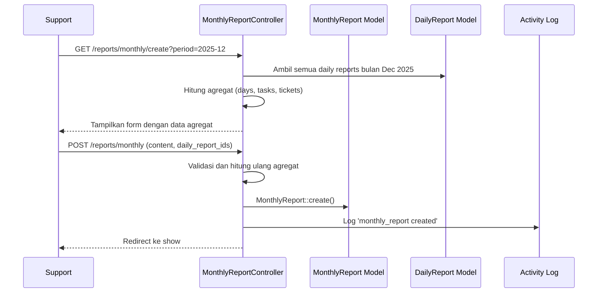
```mermaid
sequenceDiagram
    participant S as Support
    participant MRC as MonthlyReportController
    participant MR as MonthlyReport Model
    participant DR as DailyReport Model
    participant AL as Activity Log

    S->>MRC: GET /reports/monthly/create?period=2025-12
    MRC->>DR: Ambil semua daily reports bulan Dec 2025
    MRC->>MRC: Hitung agregat (days, tasks, tickets)
    MRC-->>S: Tampilkan form dengan data agregat

    S->>MRC: POST /reports/monthly (content, daily_report_ids)
    MRC->>MRC: Validasi dan hitung ulang agregat
    MRC->>MR: MonthlyReport::create()
    MRC->>AL: Log 'monthly_report created'
    MRC-->>S: Redirect ke show
```

### 10.4 Data Agregat

| Field                 | Deskripsi                                     |
| --------------------- | --------------------------------------------- |
| `total_days_reported` | Jumlah hari dengan laporan                    |
| `total_tasks`         | Total tugas dari semua daily reports          |
| `total_tickets`       | Total tiket (unique) dari semua daily reports |
| `daily_report_ids`    | Array ID daily reports yang termasuk          |

### 10.5 Permissions

| Permission              | Deskripsi             |
| ----------------------- | --------------------- |
| `view-monthly-reports`  | Lihat laporan bulanan |
| `create-monthly-report` | Buat laporan bulanan  |
| `edit-monthly-report`   | Edit laporan bulanan  |
| `delete-monthly-report` | Hapus laporan bulanan |
| `verify-daily-report`   | Verifikasi laporan    |

---

## 11. Modul Activity Log

### 11.1 Deskripsi

Activity Log mencatat semua aktivitas penting yang terjadi dalam sistem untuk keperluan audit.

### 11.2 Controller

**Controller:** `app/Http/Controllers/Logs/ActivityLogController.php`

| Method    | Route           | HTTP | Deskripsi                |
| --------- | --------------- | ---- | ------------------------ |
| `index()` | `/activity-log` | GET  | Daftar log dengan filter |

**Middleware:** `role:admin|manager`

### 11.3 Jenis Event yang Di-log

| Log Name         | Events                                                                            | Contoh                  |
| ---------------- | --------------------------------------------------------------------------------- | ----------------------- |
| `ticket`         | created, updated, start, close, escalate, cancel, takeover, set-priority, deleted | Ticket dibuat           |
| `task`           | created, updated, completed, deleted                                              | Task diselesaikan       |
| `daily_report`   | created, updated, verified, deleted, exported                                     | Laporan diexport ke PDF |
| `monthly_report` | created, updated, verified, deleted, exported                                     | Laporan bulanan dibuat  |
| `handbook`       | created, updated, deleted, downloaded                                             | Handbook diunduh        |
| `auth`           | login, logout                                                                     | User login              |

### 11.4 Struktur Log Entry

```php
// Contoh penggunaan helper logActivity
logActivity::add(
    'ticket',           // log_name
    'created',          // event
    $ticket,            // subject (model)
    'Ticket dibuat',    // description
    [                   // properties (opsional)
        'new' => [
            'title' => $ticket->title,
            'priority' => $ticket->priority,
            'status' => $ticket->status,
        ],
    ]
);
```

### 11.5 Filter Log

| Filter    | Parameter   | Deskripsi                            |
| --------- | ----------- | ------------------------------------ |
| Search    | `search`    | Cari di description, log_name, event |
| User      | `user_id`   | Filter berdasarkan user              |
| Date From | `date_from` | Tanggal mulai                        |
| Date To   | `date_to`   | Tanggal akhir                        |

---

## 12. Modul Profile

### 12.1 Deskripsi

Modul profile memungkinkan user untuk melihat dan mengupdate informasi profil mereka.

### 12.2 Controller

**Controller:** `app/Http/Controllers/ProfileController.php`

| Method      | Route      | HTTP   | Deskripsi              |
| ----------- | ---------- | ------ | ---------------------- |
| `edit()`    | `/profile` | GET    | Tampilkan form profile |
| `update()`  | `/profile` | PATCH  | Update profile         |
| `destroy()` | `/profile` | DELETE | Hapus akun             |

### 12.3 Data yang Dapat Diupdate

- **Name** - Nama lengkap
- **Email** - Email (jika berubah, `email_verified_at` di-reset)

### 12.4 Alur Update Profile

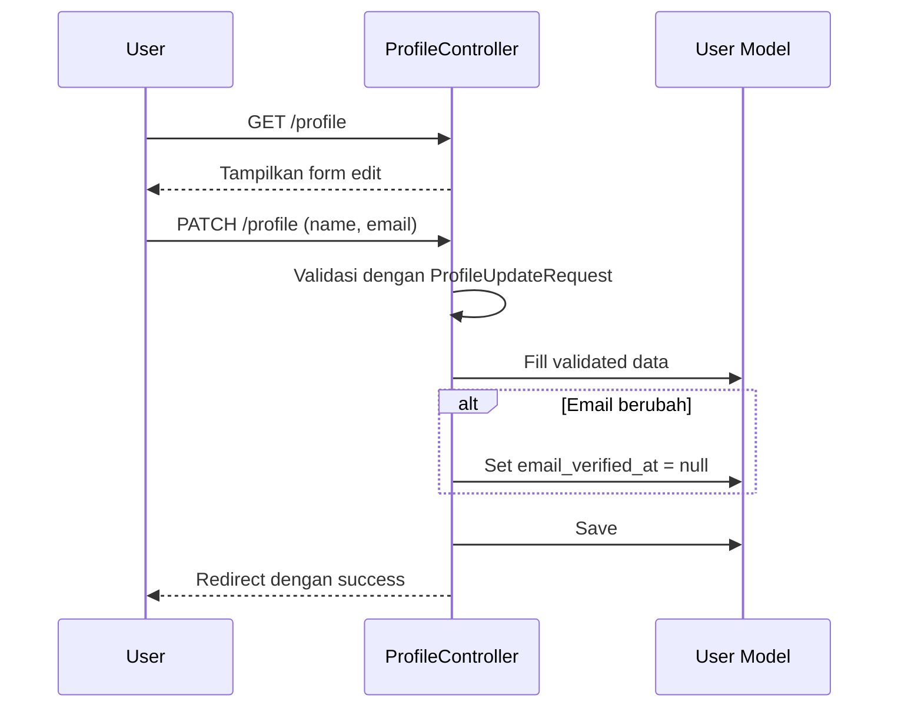
```mermaid
sequenceDiagram
    participant U as User
    participant PC as ProfileController
    participant UM as User Model

    U->>PC: GET /profile
    PC-->>U: Tampilkan form edit

    U->>PC: PATCH /profile (name, email)
    PC->>PC: Validasi dengan ProfileUpdateRequest
    PC->>UM: Fill validated data
    alt Email berubah
        PC->>UM: Set email_verified_at = null
    end
    PC->>UM: Save
    PC-->>U: Redirect dengan success
```

### 12.5 Penghapusan Akun

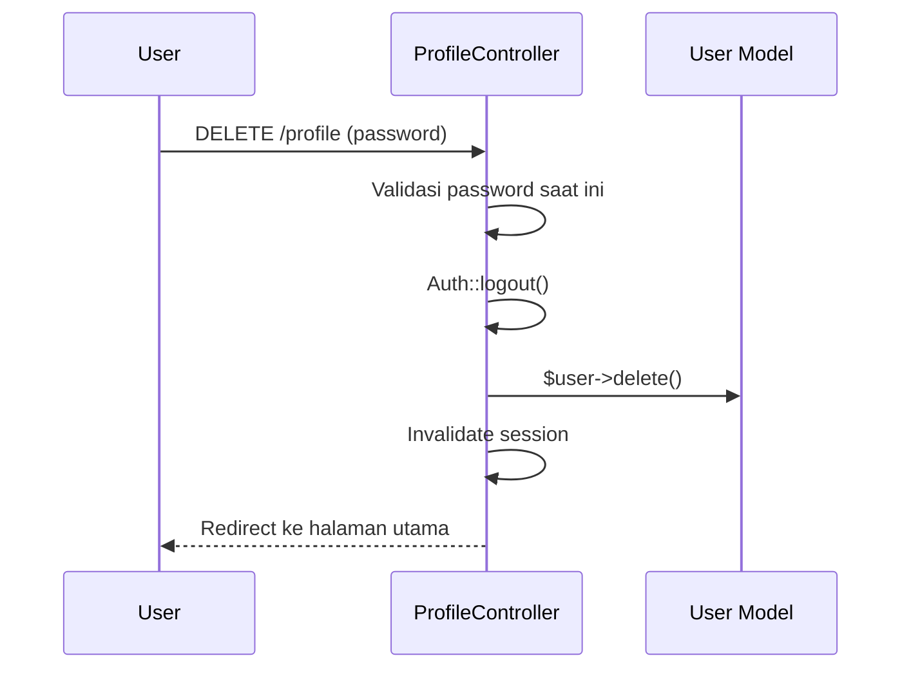
```mermaid
sequenceDiagram
    participant U as User
    participant PC as ProfileController
    participant UM as User Model

    U->>PC: DELETE /profile (password)
    PC->>PC: Validasi password saat ini
    PC->>PC: Auth::logout()
    PC->>UM: $user->delete()
    PC->>PC: Invalidate session
    PC-->>U: Redirect ke halaman utama
```

---

## 13. API Reference

### 13.1 Autentikasi API

Semua endpoint API (kecuali login/register) memerlukan token Bearer dari Laravel Sanctum.

```
Authorization: Bearer {token}
```

### 13.2 Endpoint Public

| Method | Endpoint        | Deskripsi                |
| ------ | --------------- | ------------------------ |
| POST   | `/api/login`    | Login dan dapatkan token |
| POST   | `/api/register` | Register user baru       |

### 13.3 Endpoint Protected

#### User & Auth

| Method | Endpoint      | Deskripsi             |
| ------ | ------------- | --------------------- |
| GET    | `/api/me`     | Get current user info |
| POST   | `/api/logout` | Revoke token          |

#### Tickets

| Method | Endpoint                             | Deskripsi          |
| ------ | ------------------------------------ | ------------------ |
| GET    | `/api/tickets`                       | List semua tickets |
| GET    | `/api/tickets/{id}`                  | Detail ticket      |
| POST   | `/api/ticket-create`                 | Buat ticket baru   |
| PUT    | `/api/tickets/{id}`                  | Update ticket      |
| DELETE | `/api/tickets/{id}`                  | Hapus ticket       |
| POST   | `/api/ticket/{id}/start`             | Mulai kerjakan     |
| POST   | `/api/ticket/{id}/close`             | Selesaikan ticket  |
| POST   | `/api/ticket/{id}/escalate`          | Eskalasi ticket    |
| POST   | `/api/ticket/{id}/handle-escalation` | Handle eskalasi    |
| POST   | `/api/ticket/{id}/close-admin`       | Close oleh admin   |

#### Tasks

| Method | Endpoint                   | Deskripsi                             |
| ------ | -------------------------- | ------------------------------------- |
| GET    | `/api/tasks`               | List tasks (?frequency=daily/monthly) |
| GET    | `/api/tasks/{id}`          | Detail task                           |
| POST   | `/api/tasks`               | Buat task baru                        |
| PUT    | `/api/tasks/{id}`          | Update task                           |
| DELETE | `/api/tasks/{id}`          | Hapus task                            |
| POST   | `/api/tasks/{id}/complete` | Tandai selesai                        |

#### Daily Reports

| Method | Endpoint                         | Deskripsi          |
| ------ | -------------------------------- | ------------------ |
| GET    | `/api/reports/daily`             | List daily reports |
| GET    | `/api/reports/daily/{id}`        | Detail report      |
| POST   | `/api/reports/daily`             | Buat report        |
| PUT    | `/api/reports/daily/{id}/verify` | Verifikasi         |
| DELETE | `/api/reports/daily/{id}`        | Hapus report       |

#### Monthly Reports

| Method | Endpoint                    | Deskripsi            |
| ------ | --------------------------- | -------------------- |
| GET    | `/api/reports/monthly`      | List monthly reports |
| GET    | `/api/reports/monthly/{id}` | Detail report        |
| POST   | `/api/reports/monthly`      | Buat report          |
| PUT    | `/api/reports/monthly/{id}` | Update report        |
| DELETE | `/api/reports/monthly/{id}` | Hapus report         |

---

## 14. Alur Data & Workflow

### 14.1 Alur Data Keseluruhan Sistem

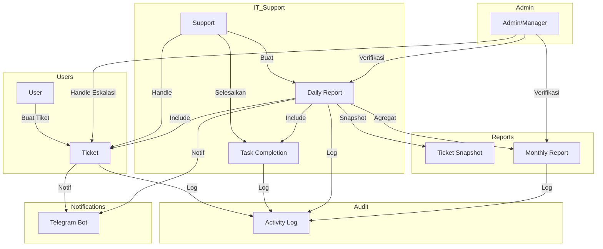
```mermaid
flowchart TB
    subgraph Users
        U[User] --> |Buat Tiket| T[Ticket]
    end

    subgraph IT_Support
        S[Support]
        S --> |Handle| T
        S --> |Selesaikan| TC[Task Completion]
        S --> |Buat| DR[Daily Report]
    end

    subgraph Reports
        DR --> |Include| T
        DR --> |Include| TC
        DR --> |Snapshot| DRTS[Ticket Snapshot]
        DR --> |Agregat| MR[Monthly Report]
    end

    subgraph Admin
        A[Admin/Manager]
        A --> |Verifikasi| DR
        A --> |Verifikasi| MR
        A --> |Handle Eskalasi| T
    end

    subgraph Notifications
        TG[Telegram Bot]
        T --> |Notif| TG
        DR --> |Notif| TG
    end

    subgraph Audit
        AL[Activity Log]
        T --> |Log| AL
        TC --> |Log| AL
        DR --> |Log| AL
        MR --> |Log| AL
    end
```

### 14.2 Lifecycle Lengkap Ticket

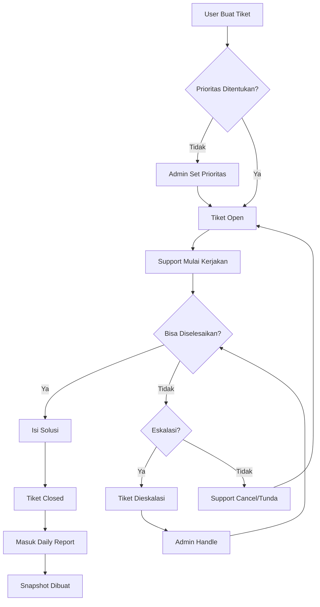
```mermaid
flowchart TD
    A[User Buat Tiket] --> B{Prioritas Ditentukan?}
    B --> |Tidak| C[Admin Set Prioritas]
    B --> |Ya| D[Tiket Open]
    C --> D

    D --> E[Support Mulai Kerjakan]
    E --> F{Bisa Diselesaikan?}

    F --> |Ya| G[Isi Solusi]
    G --> H[Tiket Closed]

    F --> |Tidak| I{Eskalasi?}
    I --> |Ya| J[Tiket Dieskalasi]
    J --> K[Admin Handle]
    K --> F

    I --> |Tidak| L[Support Cancel/Tunda]
    L --> D

    H --> M[Masuk Daily Report]
    M --> N[Snapshot Dibuat]
```

### 14.3 Proses Reporting Lengkap

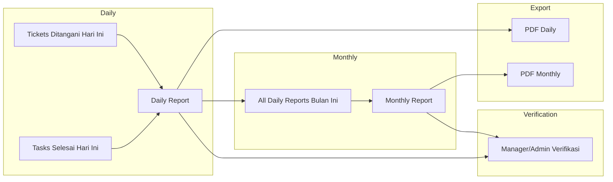
```mermaid
flowchart LR
    subgraph Daily
        A[Tasks Selesai Hari Ini]
        B[Tickets Ditangani Hari Ini]
        C[Daily Report]
        A --> C
        B --> C
    end

    subgraph Monthly
        D[All Daily Reports Bulan Ini]
        E[Monthly Report]
        C --> D
        D --> E
    end

    subgraph Export
        F[PDF Daily]
        G[PDF Monthly]
        C --> F
        E --> G
    end

    subgraph Verification
        H[Manager/Admin Verifikasi]
        C --> H
        E --> H
    end
```

---

## 📚 Appendix

### A. Timezone

Sistem menggunakan timezone **Asia/Makassar (WITA)**. Helper `DateHelper` digunakan untuk konversi:

```php
// Mendapatkan tanggal hari ini dalam WITA
$today = DateHelper::todayWita();

// Mendapatkan range UTC untuk hari ini dalam WITA
[$startUtc, $endUtc] = DateHelper::todayWitaUtcRange();
```

### B. Telegram Notification

Notifikasi otomatis dikirim untuk:

- Tiket baru masuk
- Tiket dieskalasi
- Prioritas tiket ditetapkan
- Laporan harian dibuat
- Laporan diverifikasi

### C. PDF Generation

Menggunakan **Spatie Laravel PDF** untuk generate PDF:

- Daily Report PDF
- Monthly Report PDF
- Handbook download

### D. Permission List

| Permission              | Deskripsi             |
| ----------------------- | --------------------- |
| `view-any-tickets`      | Lihat semua tiket     |
| `edit-own-ticket`       | Edit tiket sendiri    |
| `delete-own-ticket`     | Hapus tiket sendiri   |
| `handle-ticket`         | Kerjakan tiket        |
| `close-ticket`          | Tutup tiket           |
| `escalate-ticket`       | Eskalasi tiket        |
| `take-over`             | Ambil alih tiket      |
| `set-ticket-priority`   | Set prioritas         |
| `view-tasks`            | Lihat tugas           |
| `view-monthly-reports`  | Lihat laporan bulanan |
| `create-monthly-report` | Buat laporan bulanan  |
| `edit-monthly-report`   | Edit laporan bulanan  |
| `delete-monthly-report` | Hapus laporan bulanan |
| `verify-daily-report`   | Verifikasi laporan    |

---

> **Helpdesk IT System v1.0**
